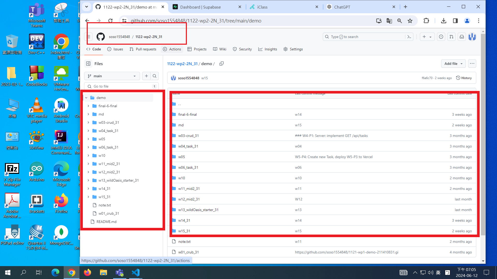
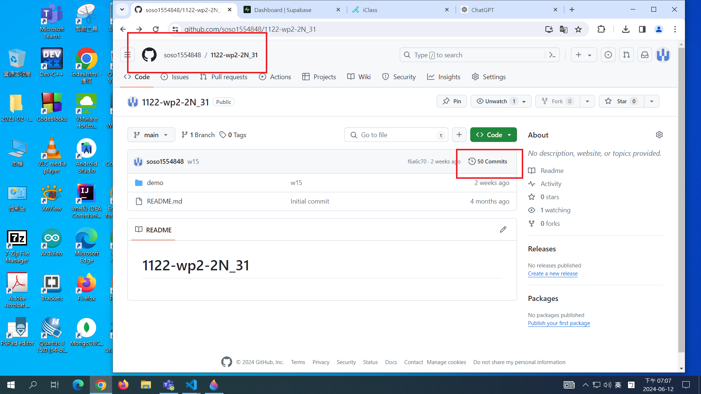
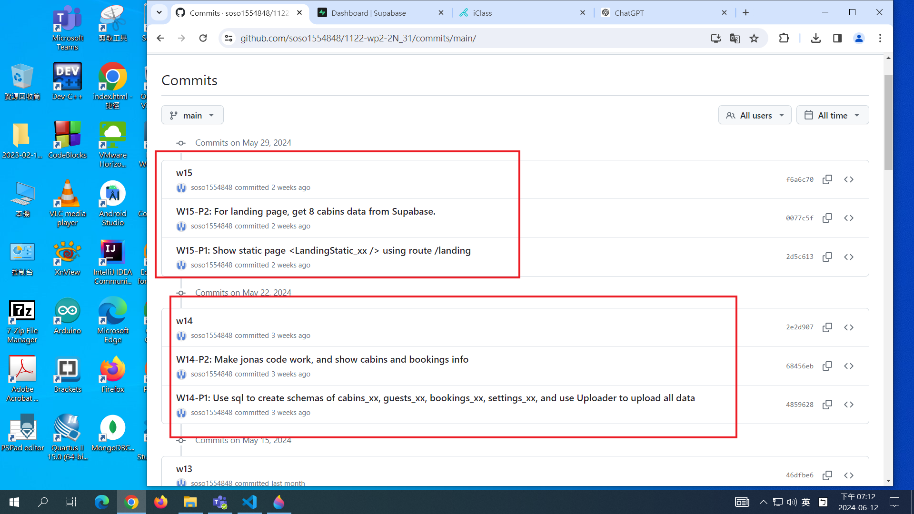
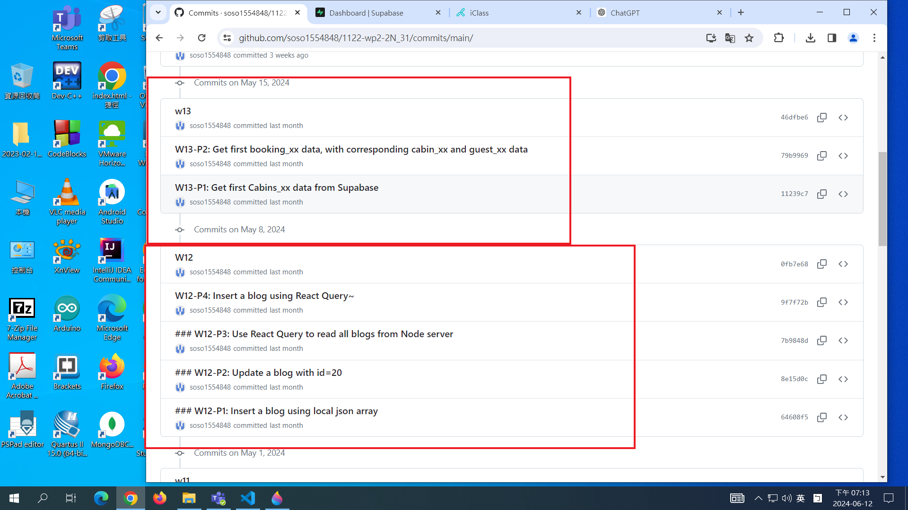
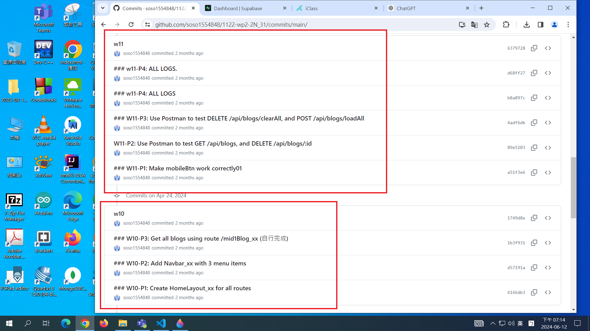
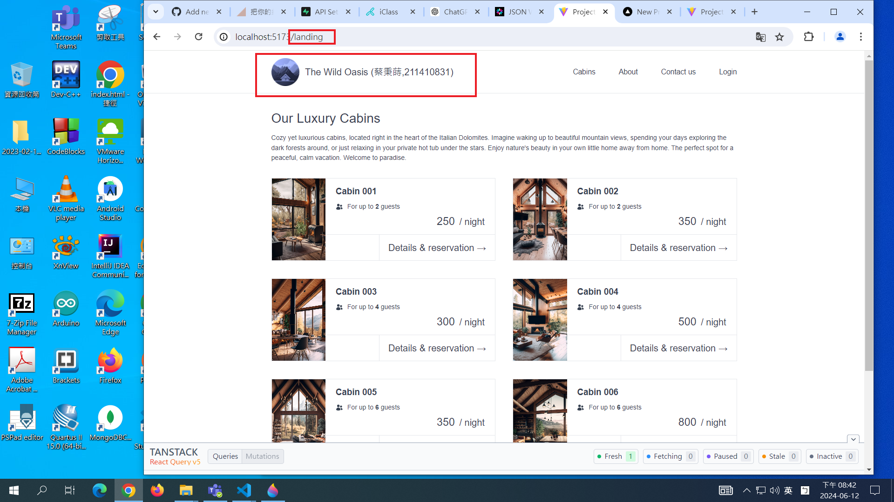

# (100%) Web 程式設計 2N 期末上機考-2 -- 開放考試

##### 2024-4-12 at E201

#### Note:

1. 請不要發揮同學愛，作弊雙方除了本次考試 0 分外，平常分數另扣 20 分，情節嚴重者會送校。
2. iClass 上請繳交 md_xx.zip，還有 f2_xx.zip 2 個檔 (node_modules 請刪除)
3. 請直接將答案寫在 f2_xx.md 上，老師實作的圖片放在 f2_htc.pdf 上，請依照老師所給的圖片來實作並標註
4. 請用老師提供的 f2_xx code 來實作 P2, P3, P4 等 3 題
5. 跟期中考相關的檔案及目錄名稱有 xx 時，必須要改成學號後 2 碼，沒有修改時，會視違犯情況扣分。跟期中考題無關的檔案及目錄名稱有 xx，則不必修改。
6. 每一張圖片要有機房左側背景，圖片上要有你的學號(或後兩碼)，圖片標註要跟老師所標註的類似。違者會依情節扣分。
7. 有標註要 git log 的題目，必須要做，這是我們上課練習的一部分。
8. 請自評分數，將每一題的 ? 填入分數，沒有填者，不會批改，以 0 分計算。

##### Your (Name, ID): (蔡秉蒔, 211410831)

##### f2 開放網路題目 (50%)

- P1-1 (10%): 10 分
- P1-2 (10%): 10 分
- P1-3 (10%): ? 分
- P1-4 (10%): ? 分
- P2 (15%): ? 分
- P3 (20%): ? 分
- P4-1 (5%): ? 分
- P4-2 (10%): ? 分
- P4-3 (10%): ? 分

##### 總分: ? 分

---

## (40%) P1: Show Info of Your Github Repo, Client Supa Github, Vercel as follows

#### (10%) P1-1: Show Your Github Repo for all md and demo

##### => My Github repo URL

[https://github.com/htchung/1122-wp2-2N_xx](https://github.com/htchung/1122-wp2-2N_xx)

#### => 下圖左邊框顯示所有的 demo，右邊框顯示所有的 md


#### Your Answer

##### => My Github repo URL

[My Github repo URL for demo](https://github.com/soso1554848/1122-wp2-2N_31.git)

#### => 下圖左邊框顯示所有的 demo，右邊框顯示所有的 md



##### => git log

```

```

---

#### (10%) P1-2: Show all your git logs from W10 to W15

##### => My Github URL for git logs，標註本學期 git log 次數

[My Github URL for git logs]()


#### => git log for w15 and w14


#### => git log for w13 and w12


#### => git log for w11 and w10


#### Your Answer

##### => My Github URL for git logs，標註本學期 git log 次數



#### => git log for w15 and w14



#### => git log for w13 and w12



#### => git log for w11 and w10



##### => git log

```

```

---

#### (10%) P1-3: 佈署 w15 demo 到 Vercel，並顯示如下資訊

[w15 demo deploy to Vercel]()

##### => 顯示在 Vercel 上的 landing page


##### => 透過 Vercel 頁面，以含有你學號的 email login，登入後在 Dashboard 頁面顯示你個人及 登入之 user 資訊


#### Your Answer

##### => 顯示在 Vercel 上的 landing page



##### => 透過 Vercel 頁面，以含有你學號的 email login，登入後在 Dashboard 頁面顯示你個人及 登入之 user 資訊


##### => Dashboard 之程式碼 (code)


##### => git log

```

```

---

#### (10%) P1-4: 透過 P1-3 之程式登入後取得 Supabase access token, api keys

##### => 登入後，取得 access token


##### => 從 jwt.io 檢視 access token


##### => Project URL & anon key


#### Your Answer

##### => 登入後，取得 access token


##### => 從 jwt.io 檢視 access token


##### => Project URL & anon key


##### => git log

```

```

---

# 以下 P2, P3, P4 題目請透過老師提供的 f2_xx 來實作，跟 P2, P3, P3 有關的檔案及目錄，如有 xx 需改成學號後兩碼，跟期中考無關的檔案及目錄出現 xx，則不需要修改。

## (15%) P2: 實作路由 /about_xx，點選上方選單 About_xx，可以顯示 About 訊息如下圖


#### Your Answer

##### => Chrome 顯示圖片如上


##### => 相關重點 code 說明


##### => git log

```

```

---

#### (20%) P3: 請實作 /cabins_xx/:id，當點選 Details and reservation 時，顯示該 cabin id 的詳細資訊，如下圖。

如果直接從全部 cabins 中篩選 id，顯示所要的畫面，而沒有實作 /cabins_xx/:id 路由者，得 10 分。

以下老師顯示 Cabin 001 及 008 兩筆。同學們顯示請以你的學號後兩個數字分別除以 8 取餘數來決定。舉例，如果學號最後兩個數字為 85，則先顯示 Cabin 005, 後顯示 Cabin 008。


##### => 點選 Cabin 001 之 Details 按鈕，顯示 Cabin 001 詳細資訊


##### => 點選 Cabin 008 之 Details 按鈕，顯示 Cabin 001 詳細資訊


#### Your Answer

##### => 以你的學號最後 1 個數字，依老師上述規則，點選對應的 Cabin 之 Details 按鈕，顯示該 Cabin 詳細資訊


##### => 以你的學號最後第 2 個數字，依老師上述規則，點選對應的 Cabin 之 Details 按鈕，顯示該 Cabin 詳細資訊


##### => CabinById_xx.jsx 相關重點 code 說明


##### => useCabinById_xx.jsx 相關重點 code 說明


##### => apiCabins.jsx 相關重點 code 說明


##### => git log

```

```

---

#### (5%) P4-1: 請在 Supabase 加入一筆有你

##### => 用 SQL 指令新增一筆有你學號的 emal


##### => 在 guests_xx 中檢查剛新增、有你學號的 guest id


##### => 列出在 Supabase 所有 cabin 的 id 及 name


#### Your Answer

##### => 用 SQL 指令新增一筆有你學號的 emal


##### => 在 guests_xx 中檢查剛新增、有你學號的 guest id


##### => 列出在 Supabase 所有 cabin 的 id 及 name


##### => git log

```

```

---

#### (10%) P4-2: 在 P3 題下面加入一個按鈕 Add Reservation，可以新增一筆預訂，請用 P4-1 的 guest id 來預訂，訂購資訊會寫入 booking_xx 中

考試時，為了節省時間，不需要產生 form，可以直接參考下圖右方老師資料來進行輸入，但是 guest id 必須符合 P4-1 你所建立的 guest id。

為了節省時間，本題不須使用 React Query。

##### => Chrome 成功寫入並正確回傳資訊


##### => 在 Supabase bookings_xx 檢查剛新增的資料，並全部列出


#### Your Answer

##### => Chrome 成功寫入並正確回傳資訊


##### => 在 Supabase bookings_xx 檢查剛新增的資料，並全部列出


##### => CabinById.jsx 相關的 code

本題可以直接呼叫 apiBooking.jsx， 不需要透過 React Query


##### => apiBooking.jsx 相關的 code


##### => git log

```

```

---

#### (5%) P4-3: 在 P3 題下面加入一個按鈕 Update Reservation，可以修改 P4-2 所建立的預訂資料

本題要修改的資料有 totalPrice，因為計算錯誤，計算公式為
(250+50)\*5 = 1500,
另外 observations 改成 'We will be late check-in after 10pm, please help pick us up at the airport.'

為了節省時間，本題不須使用 React Query。

##### => Chrome 成功寫入並正確回傳資訊


##### => 在 Supabase bookings_xx 檢查更新的資料


#### Your Answer

##### => Chrome 成功更新並正確回傳資訊


##### => 在 Supabase bookings_xx 檢查剛更新的資料，並全部列出


##### => CabinById.jsx 相關的 code

本題可以直接呼叫 apiBooking.jsx， 不需要透過 React Query


##### => apiBooking.jsx 相關的 code


##### => git log

```

```

---

#### (5%) P4-4: 在 P3 題下面加入一個按鈕 Delete Reservation，可以刪除 P4-2 所建立的預訂資料

bookingId 必須是 P4-2 所建立的 id

為了節省時間，本題不須使用 React Query。

##### => Chrome 成功刪除


##### => 在 Supabase 下 SQL 指令，顯示已經找不到刪除的資料了


#### Your Answer

##### => Chrome 成功寫入並正確回傳資訊

##### => Chrome 成功刪除


##### => 在 Supabase 下 SQL 指令，顯示已經找不到刪除的資料了


##### => CabinById.jsx 相關的 code

本題可以直接呼叫 apiBooking.jsx， 不需要透過 React Query


##### => apiBooking.jsx 相關的 code


##### => git log

```

```
