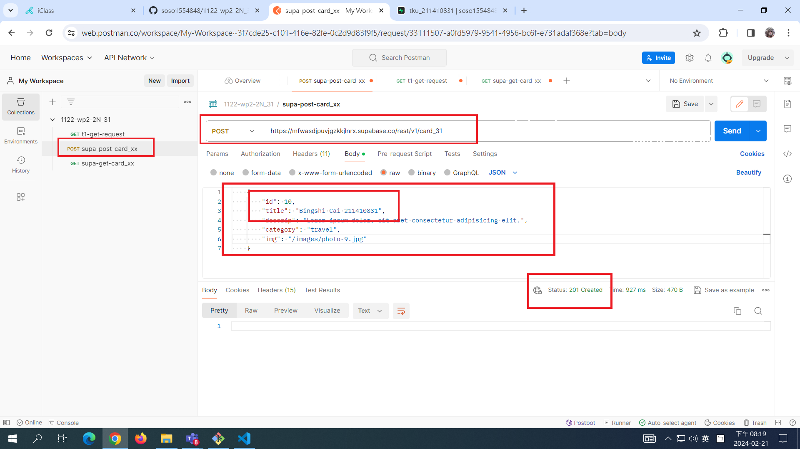
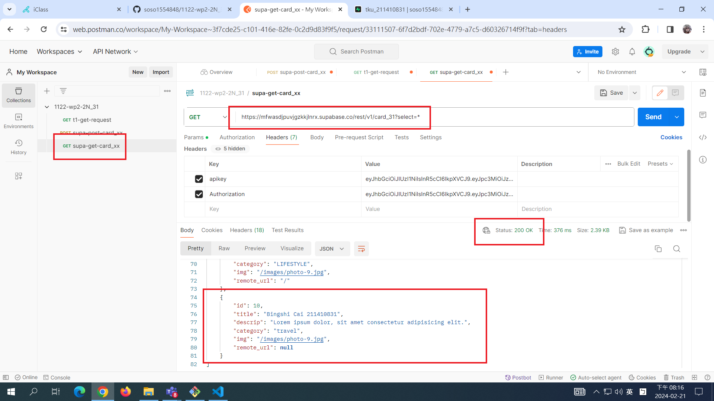
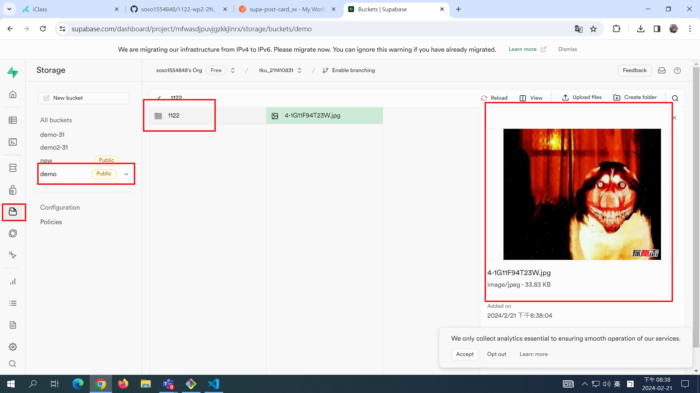
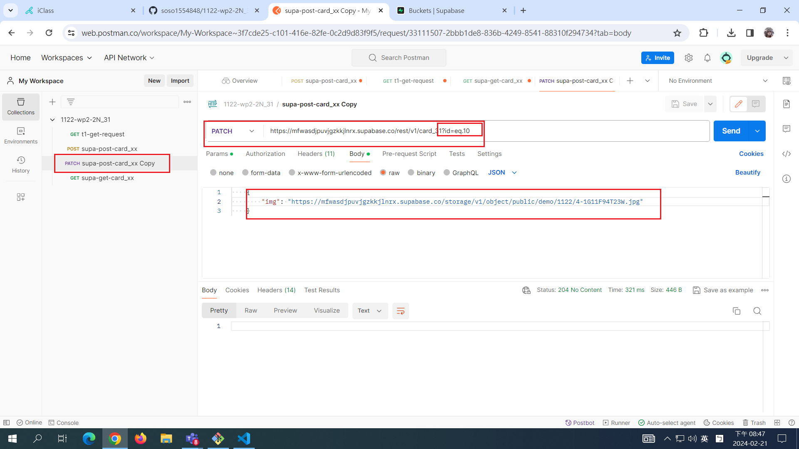
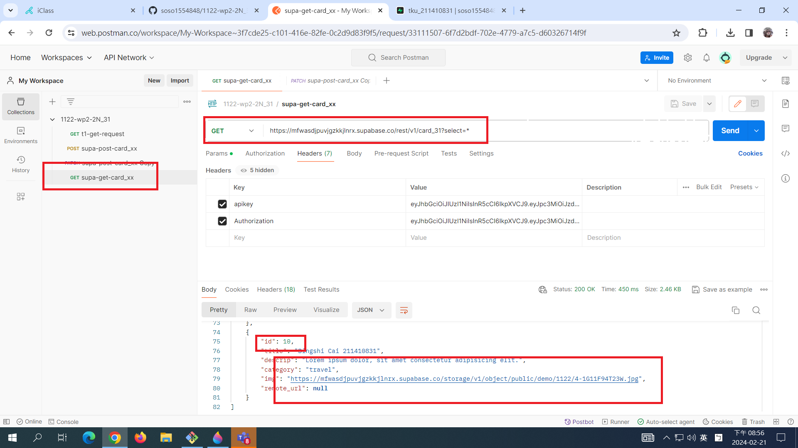
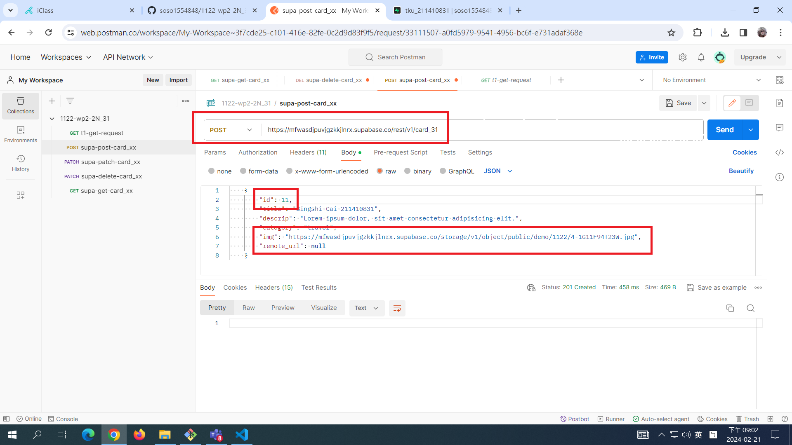
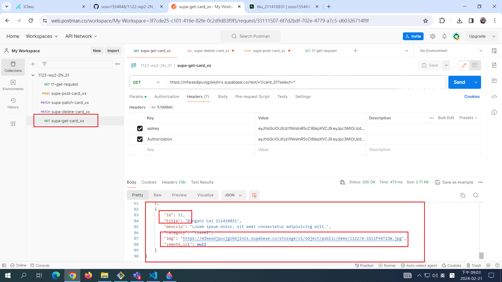
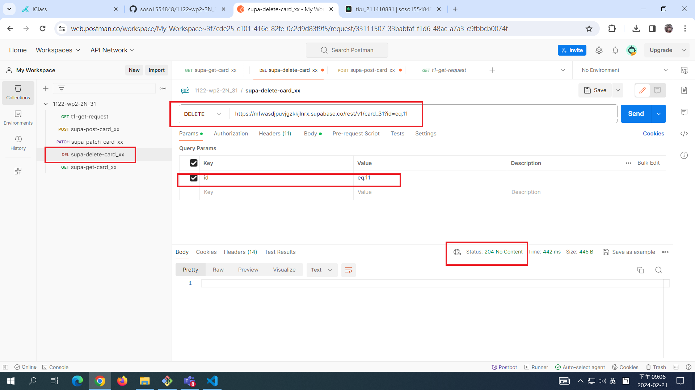
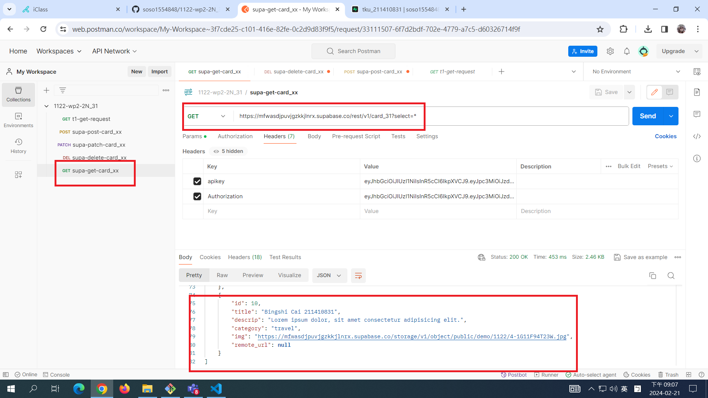

[MY GITHUB URL](https://github.com/soso1554848/1122-wp2-2N_31)

### W1-P1: Get Request demo in Postman


### W1-P2: Read card_xx table in Supabase


### W1-P3: Create a card into card_xx table in Supabase





### W1-P4: Update a card in Supabase using remote photo







### W1-P5: Delete a card in Supabase









```
git log --pretty=format:"%h%x09%an%x09%ad%x09%s" --after="2023-02-21"
```
