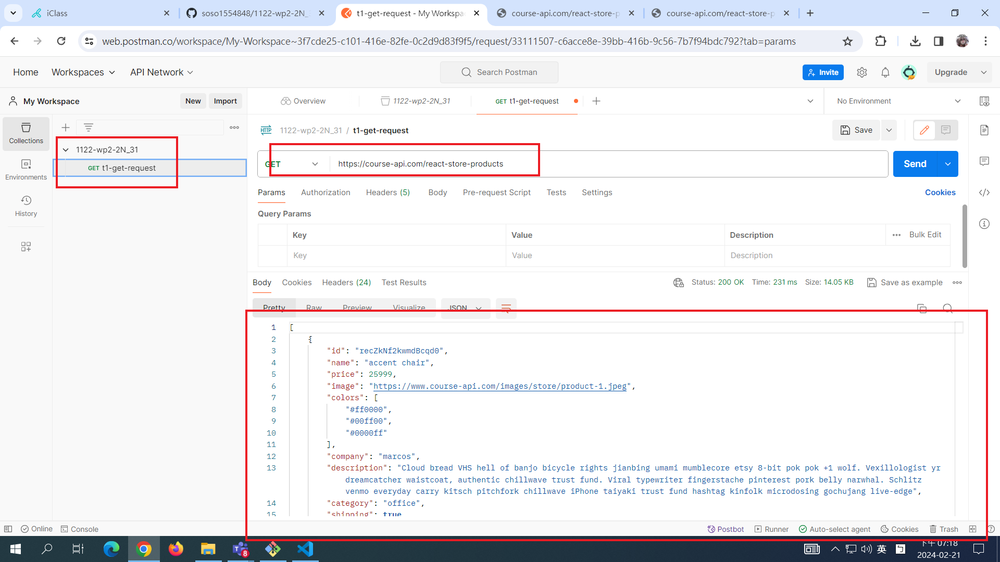
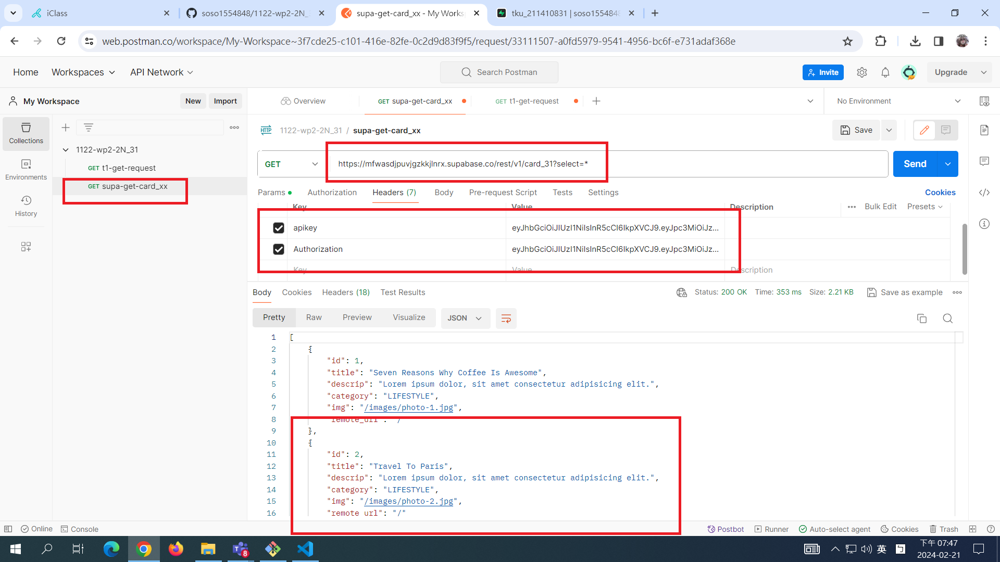

[MY GITHUB URL](https://github.com/soso1554848/1122-wp2-2N_31)

### W1-P1: Get Request demo in Postman



### W1-P2: Read card_xx table in Supabase



```
git log --pretty=format:"%h%x09%an%x09%ad%x09%s" --after="2023-02-21"
```
