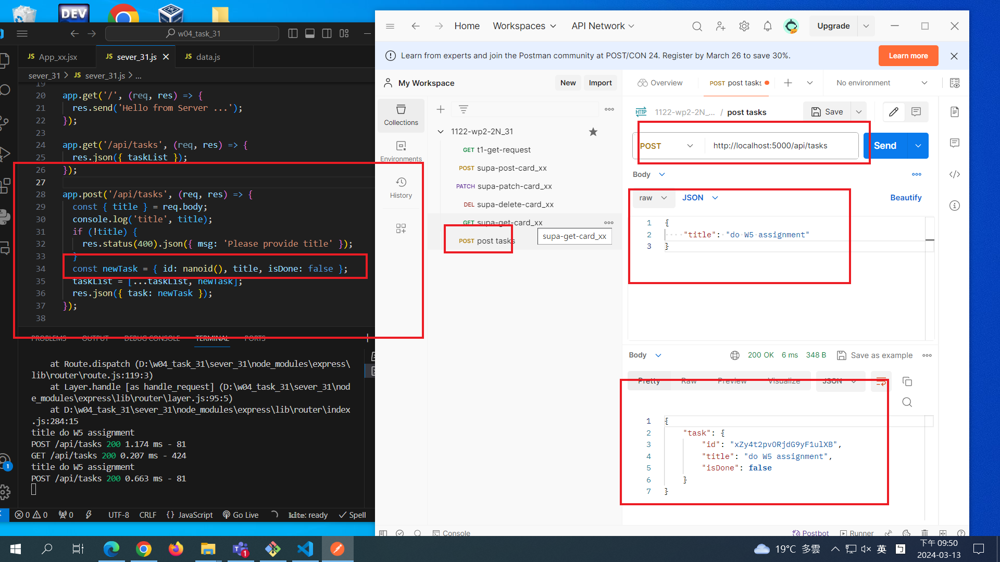
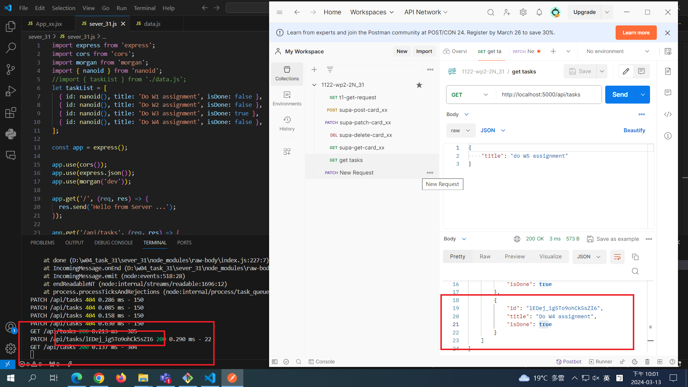

[MY GITHUB URL](https://github.com/soso1554848/1122-wp2-2N_31)

### W4-P1: Server: implement GET /api/tasks


### W4-P2: Server: implement POST /api/tasks



### W4-P3: Server: implement PATCH /api/tasks/:id



```
$ git log --pretty=format:"%h%x09%an%x09%ad%x09%s" --after="2024-03-12"
632388f soso1554848     Wed Mar 13 22:06:45 2024 +0800  ### W4-P3: Server: implement PATCH /api/tasks/:id
767aaa1 soso1554848     Wed Mar 13 22:05:59 2024 +0800  ### W4-P2: Server: implement POST
712c0f7 soso1554848     Wed Mar 13 19:21:05 2024 +0800  ### W4-P1: Server: implement GET /api/tasks
```
