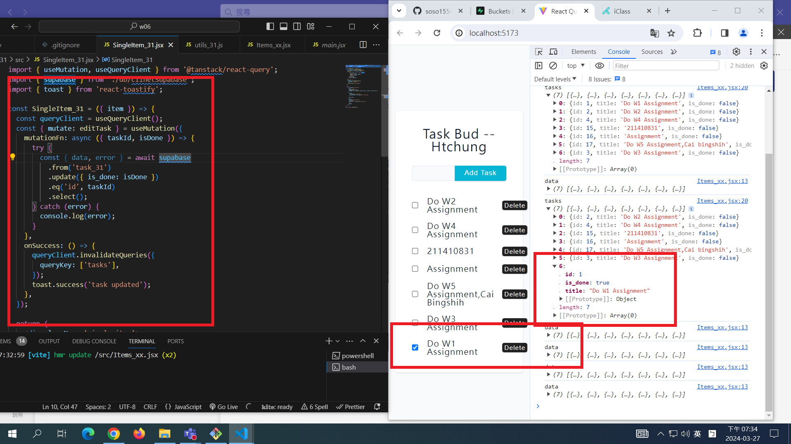
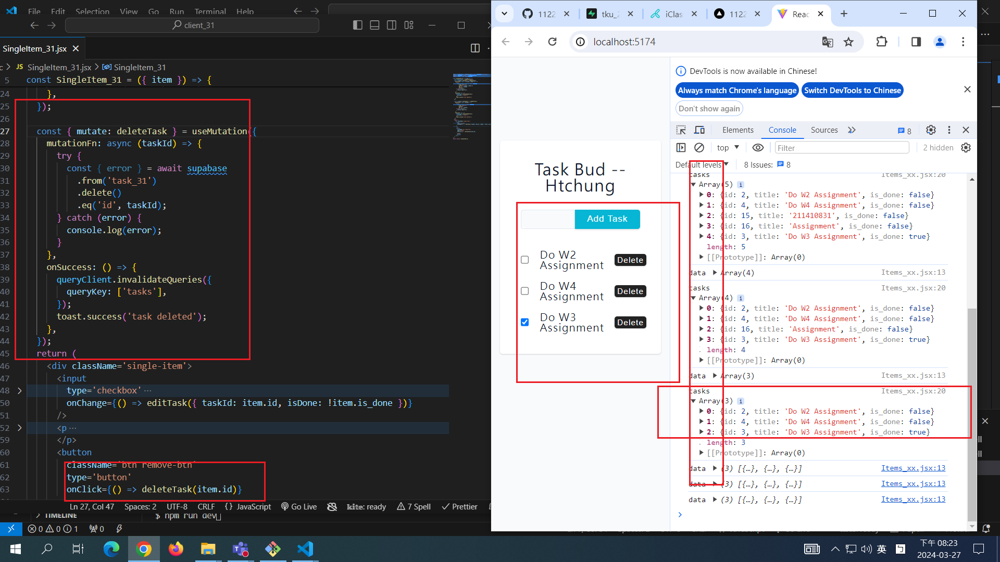
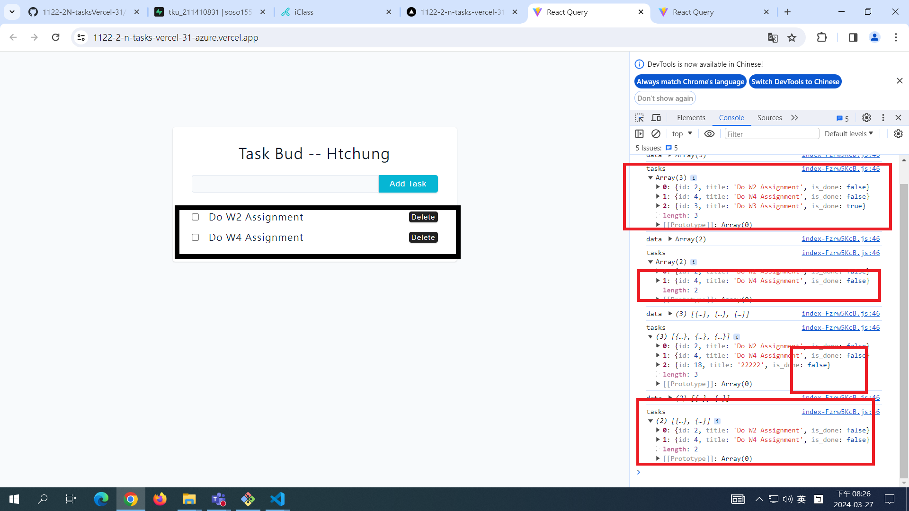

[MY GITHUB URL](https://github.com/soso1554848/1122-wp2-2N_31)

### W6-P1: Update a task in Supabase



### W6-P2: Delete a task in Supabase

#### => local



#### => Vercel: insert a task, edit the task, delete the task



### W6-P3: Get all tasks from node server


### W6-P5: Git logs of W6

```
$ git log --pretty=format:"%h%x09%an%x09%ad%x09%s" --after="2024-03-26"
91e129c soso1554848     Wed Mar 27 22:00:00 2024 +0800  W6-P3: Get all tasks from node server
8d8d482 soso1554848     Wed Mar 27 20:34:12 2024 +0800  W6-P2: Delete a task in Supabase
049312c soso1554848     Wed Mar 27 19:36:47 2024 +0800  W6-P1: Update a task in Supabase
```
