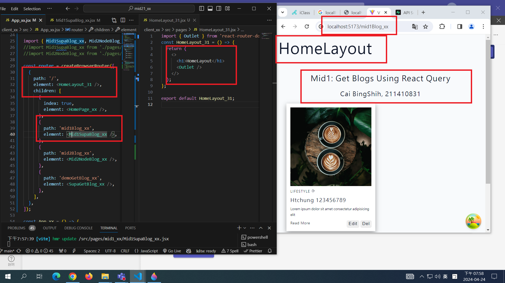

[MY GITHUB URL](https://github.com/soso1554848/1122-wp2-2N_31)

### W10-P1: Create HomeLayout_xx for all routes




### W10-P2: Add Navbar_xx with 3 menu items


### W10-P3: Get all blogs using route /mid1Blog_xx (自行完成)


### W10-P4: Git logs of W6

```
git log --pretty=format:"%h%x09%an%x09%ad%x09%s" --after="2024-04-23"
1b3f931 soso1554848     Wed Apr 24 21:48:11 2024 +0800  ### W10-P3: Get all blogs using route /mid1Blog_xx (自行完成)
d57191a soso1554848     Wed Apr 24 21:36:39 2024 +0800  ### W10-P2: Add Navbar_xx with 3 menu items
6166db3 soso1554848     Wed Apr 24 19:59:45 2024 +0800  ### W10-P1: Create HomeLayout_xx for all routes

```
