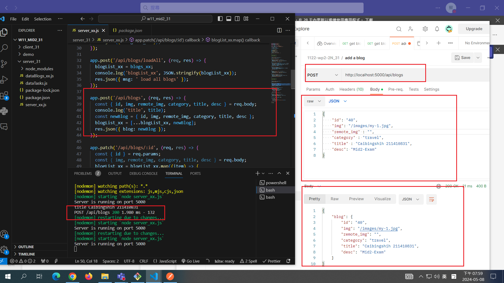
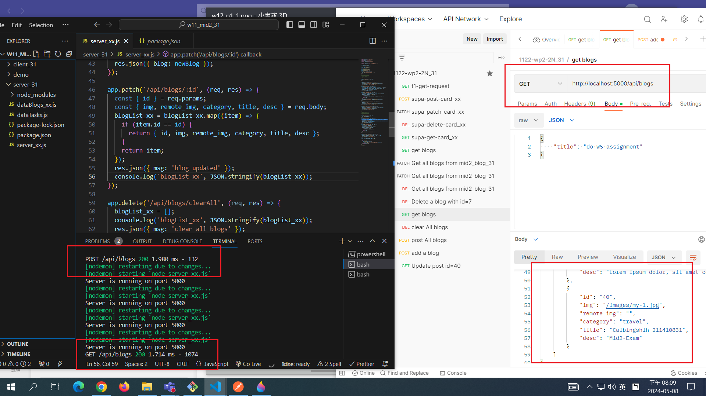
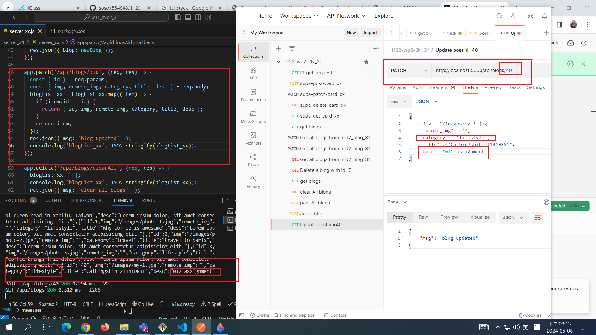
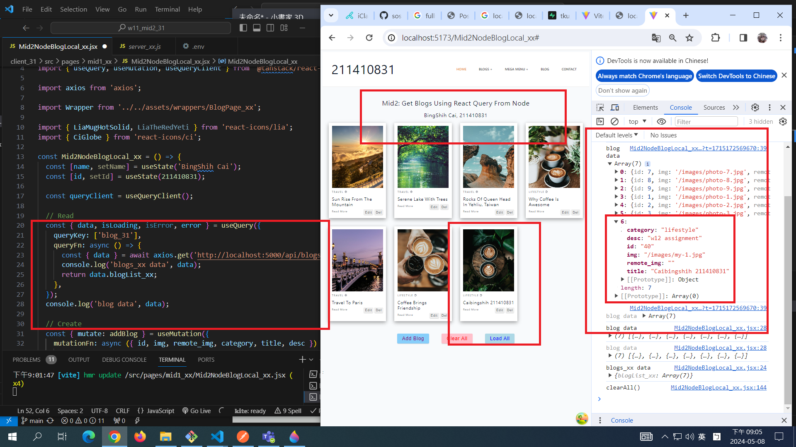

[MY GITHUB URL](https://github.com/soso1554848/1122-wp2-2N_31)

### W12-P1: Insert a blog using local json array

### W12-P2: Update a blog with id=20

### W12-P3: Use React Query to read all blogs from Node server

