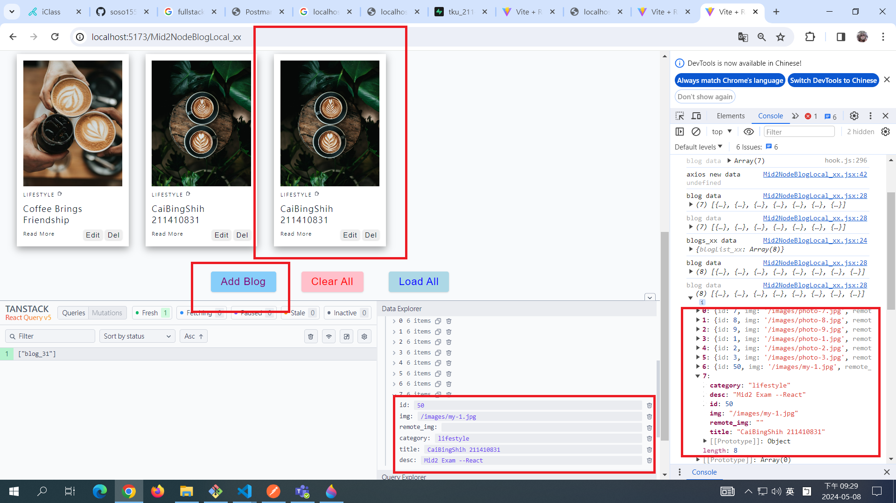
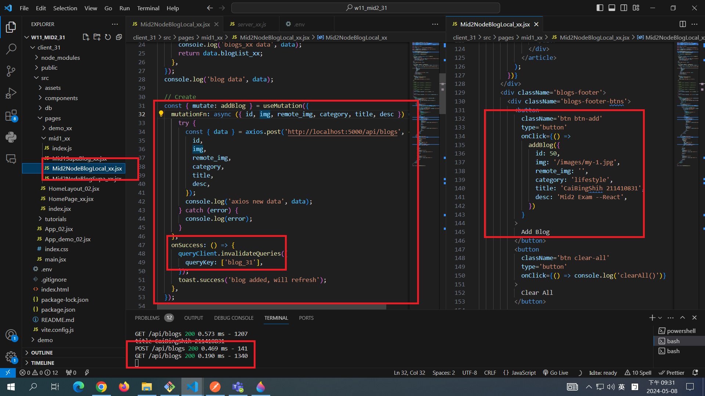

[MY GITHUB URL](https://github.com/soso1554848/1122-wp2-2N_31)

### W12-P1: Insert a blog using local json array


### W12-P2: Update a blog with id=20


### W12-P3: Use React Query to read all blogs from Node server


### W12-P4: Insert a blog using React Query





### W12-P5: Git logs of W11

```
$ git log --pretty=format:"%h%x09%an%x09%ad%x09%s" --after="2024-05-07"
9f7f72b soso1554848     Wed May 8 21:32:42 2024 +0800   W12-P4: Insert a blog using React Query~
7b9848d soso1554848     Wed May 8 21:07:06 2024 +0800   ### W12-P3: Use React Query to read all blogs from Node server
8e15d0c soso1554848     Wed May 8 20:17:57 2024 +0800   ### W12-P2: Update a blog with id=20
64608f5 soso1554848     Wed May 8 20:11:26 2024 +0800   ### W12-P1: Insert a blog using local json array
```
