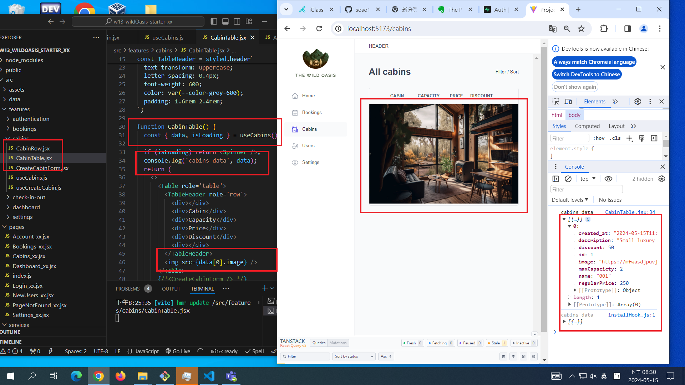
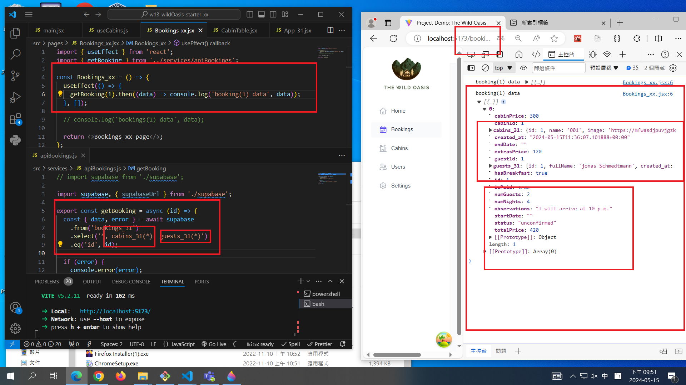

[MY GITHUB URL](https://github.com/soso1554848/1122-wp2-2N_31)

### W13-P1: Get first Cabins_xx data from Supabase



### W13-P2: Get first booking_xx data, with corresponding cabin_xx and guest_xx data



### W13-P3: Git logs of W13

```
$ git log --pretty=format:"%h%x09%an%x09%ad%x09%s" --after="2024-05-14"
79b9969 soso1554848     Wed May 15 21:56:41 2024 +0800  W13-P2: Get first booking_xx data, with corresponding cabin_xx and guest_xx data
11239c7 soso1554848     Wed May 15 21:55:22 2024 +0800  W13-P1: Get first Cabins_xx data from Supabase
```
