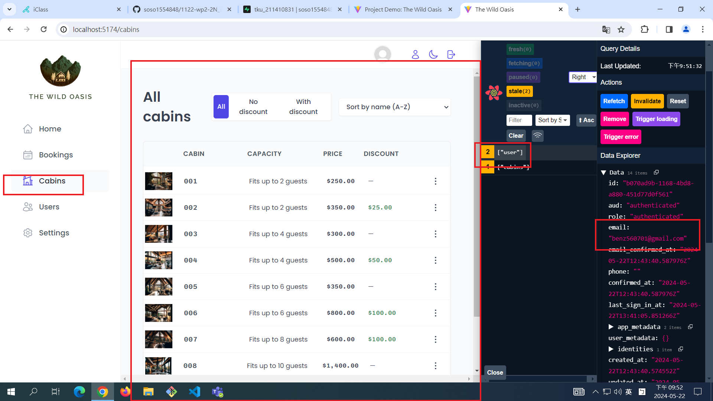
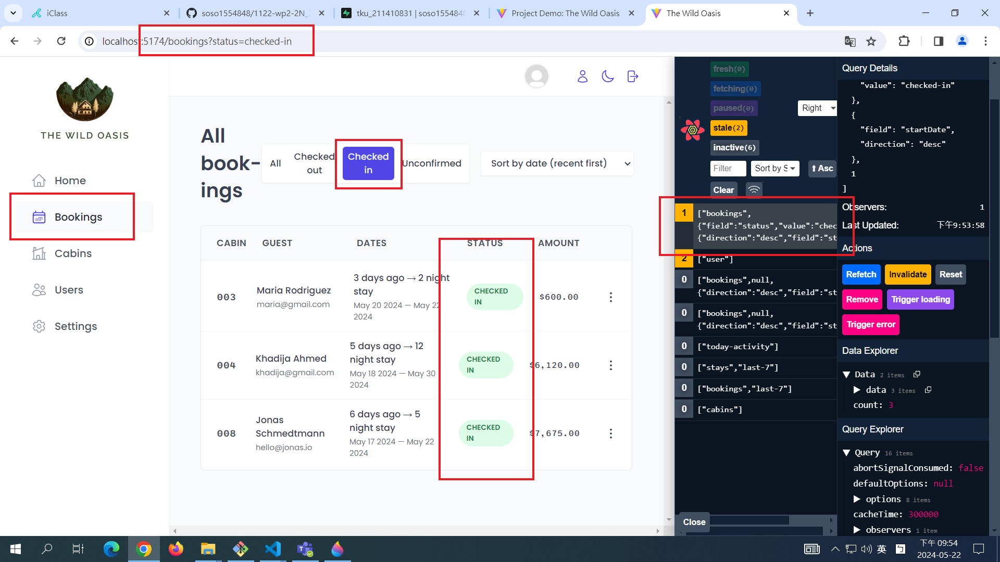
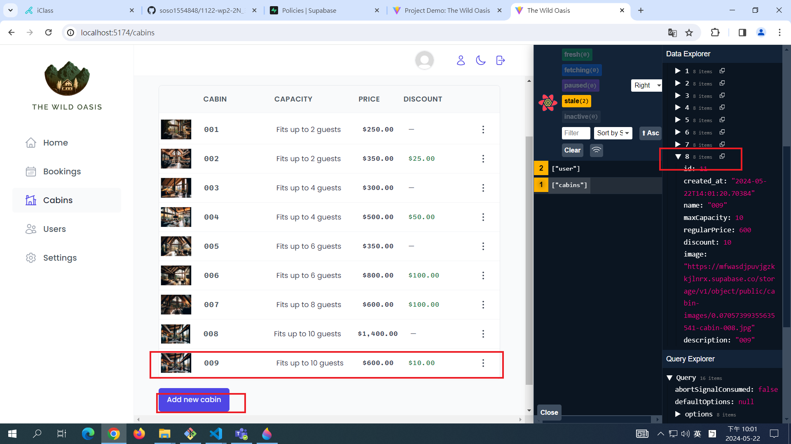

[MY GITHUB URL](https://github.com/soso1554848/1122-wp2-2N_31)

### W14-P1: Use sql to create schemas of cabins_xx, guests_xx, bookings_xx, settings_xx, and use Uploader to upload all data


### W14-P2: Make jonas code work, and show cabins and bookings info







### W13-P3: Git logs of W13

```
$ git log --pretty=format:"%h%x09%an%x09%ad%x09%s" --after="2024-05-21"
```
