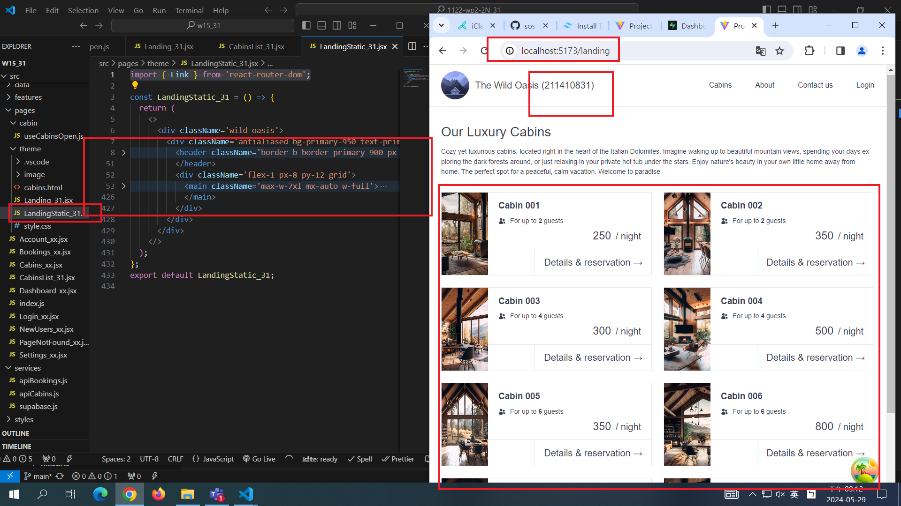

[MY GITHUB URL](https://github.com/soso1554848/1122-wp2-2N_31)

### W15-P1: Show static page <LandingStatic_xx /> using route /landing

### W15-P2: For landing page, get 8 cabins data from Supabase

