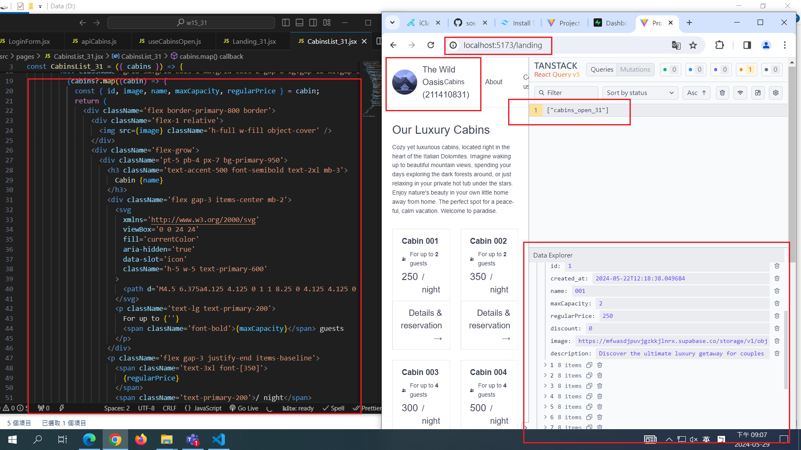

[MY GITHUB URL](https://github.com/soso1554848/1122-wp2-2N_31)

### W15-P1: Show static page <LandingStatic_xx /> using route /landing


### W15-P2: For landing page, get 8 cabins data from Supabase.



### W15-P4: Git logs of W15

```
$ git log --pretty=format:"%h%x09%an%x09%ad%x09%s" --after="2024-05-21"
68456eb soso1554848     Wed May 22 22:04:23 2024 +0800  W14-P2: Make jonas code work, and show cabins and bookings info
4859628 soso1554848     Wed May 22 20:28:49 2024 +0800  W14-P1: Use sql to create schemas of cabins_xx, guests_xx, bookings_xx, settings_xx, and use Uploader to upload all data
```
